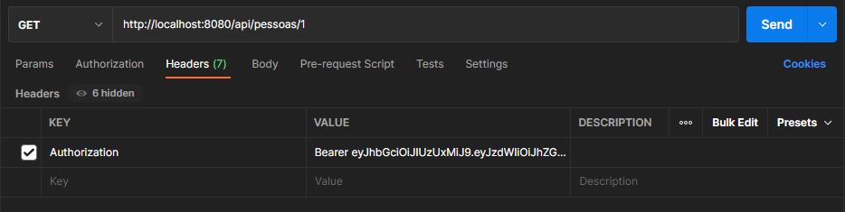

# API Rest (Avaliação Desenvolvedor Back-end Attornatus)

[](https://www.linkedin.com/in/patrick-cavalcante-moraes-a95635179/)
[](https://github.com/PatrickCavalcant)

 - Java
 - Spring Boot
 - Banco de Dados H2
 - Swagger
 - Spring Security (JWT)

### Como executar a aplicação
```
./mvnw spring-boot:run
API será executada em http://localhost:8080
```
### Objetivos
- Criar uma pessoa
- Editar uma pessoa
- Consultar uma pessoa
- Listar pessoas
- Criar endereço para pessoa
- Listar endereços da pessoa
- Poder informar qual endereço é o principal da pessoa


### Desenvolvido
- Swagger - http://localhost:8080/swagger-ui.html
- Foi implementado uma estrutura para o gerenciamento de acesso, onde só consegue acesso a API REST se tiver cadastrado o usuário, é necessário cadastrar a empresa, após cadastrar o usuário para fazer a autenticação em JWT.
- Para a autenticação na API de Segurança Spring Security com a autenticação via tokens em JWT é necessário fazer a chamado no método POST em http://localhost:8080/auth, passado no JSON os dados de acesso. 
```
{
    "email": "admin@empresa.com", 
    "senha": "123456"
}
```
- Receberá o token que é utilizado para a chamada dos demais métodos, esse token é passado no cabeçalho da chamada, juntamente com a chave de autorização(authorization).
  Antes do tocken é necessário passa o parâmetro(Bearer) dento de Value, conforme a imagem abaixo.

  <br/>
